# 건팡 - Frontend

# 1. 화면 설계
## 1.1. 스마트폰 앱
### (1) 메인 화면

<div align="center">
    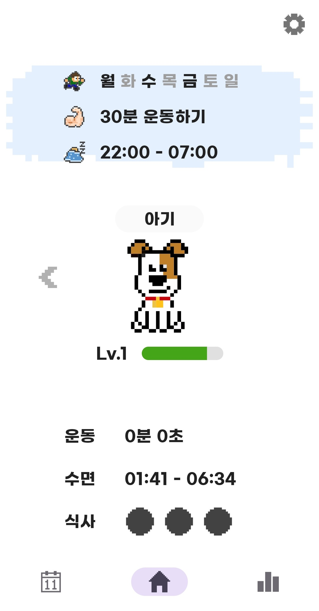
</div> 

### (2) 캘린더 화면

<div align="center">
    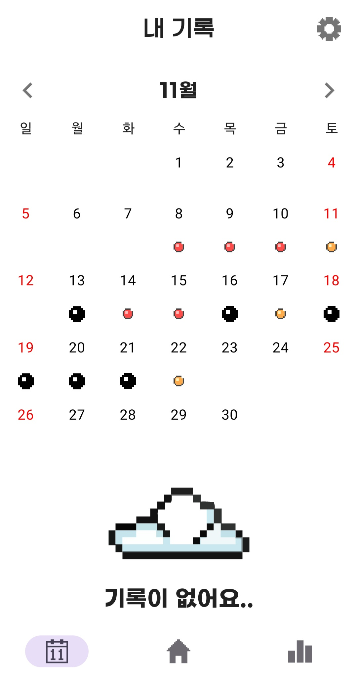
</div> 

### (3) 체성분 분석 화면

<div align="center">
    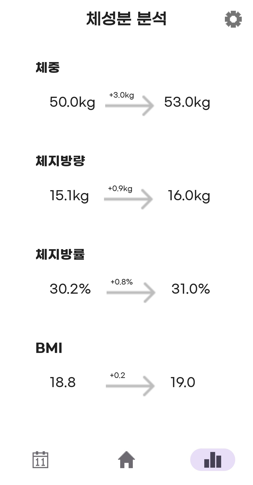
</div> 

### (4) 이전 캐릭터 화면

<div align="center">
    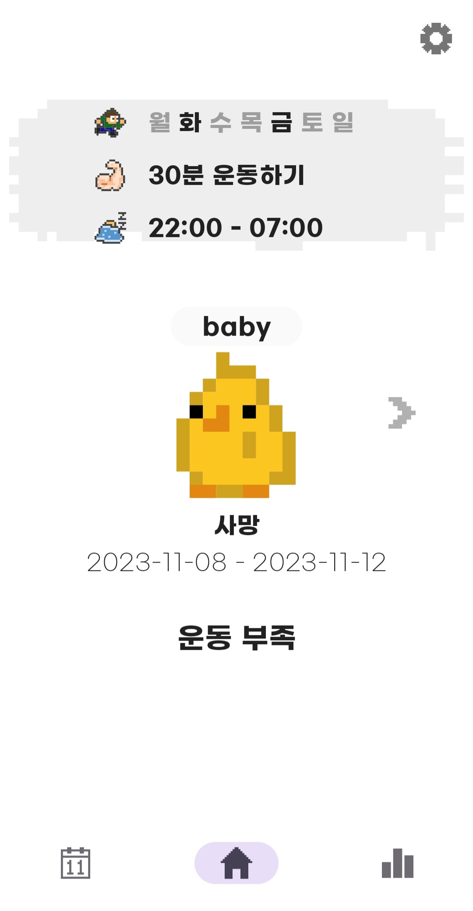
</div> 

## 2.2. 워치 앱
### user flow
<div align="center">
    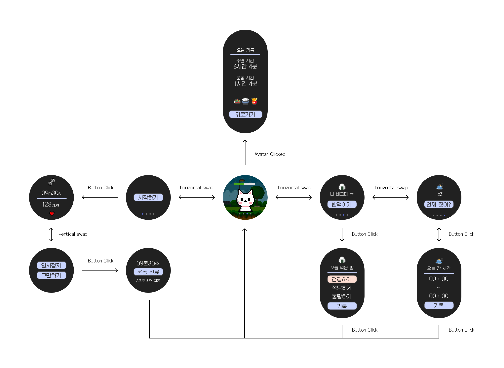
</div> 

### (1) 워치 메인 화면
<div align="center">
    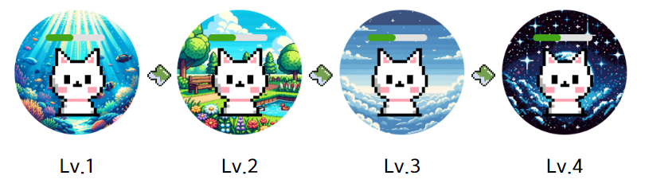
</div>

- 일주일 주기로 레벨업, 레벨업 시 배경 변화

<div align="center">
    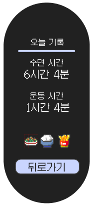
</div>

- 아바타 클릭시 오늘 기록 확인 가능

### (2) 식사, 수면기록

<div align="center">
    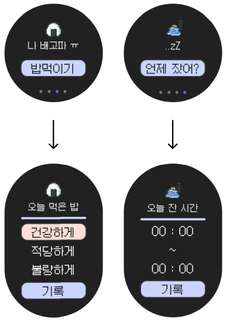
</div>

- 메인 화면에서 오른쪽으로 스와이프하면 음식, 수면 기록 가능
- 삼성 헬스에 수면 데이터가 존재하면 health connect api를 통해 정보를 가져오고, 이를 볼 수 있음

### (3) 운동기록

<div align="center">
    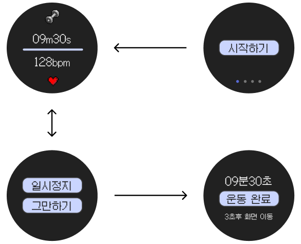
</div>

- 메인 화면에서 왼쪽으로 스와이프하면 운동 기록 가능
- 운동 기록시 현재 심박수를 읽어 실시간으로 확인 가능
- 운동 기록 완료 시 이를 워치 오늘 기록, 앱 달력 화면에서 확인 가능</br>

# 2. 사용 기술
## 2.1. Kotlin
- JetBrains에서 개발한 크로스 플랫폼 범용 프로그래밍 언어
- 자바와 완벽하게 호환되게 설계
- 건팡 앱 / 워치 개발에 사용
- 불필요한 ';', 타입선언을 줄여 코드의 가독성을 높임
- 타입 자동 추론을 사용하여 애플리케이션의 타입 안전성을 보장
- 컴파일 시점에 검사를 통해 오류를 방지

## 2.2. Jetpack Compose
- XML레이아웃 대신 선언형 함수를 사용 UI 구성
- UI 개발 효율성을 극대화
- State로 UI를 동기화하여 버그 방지

<div align="center">
    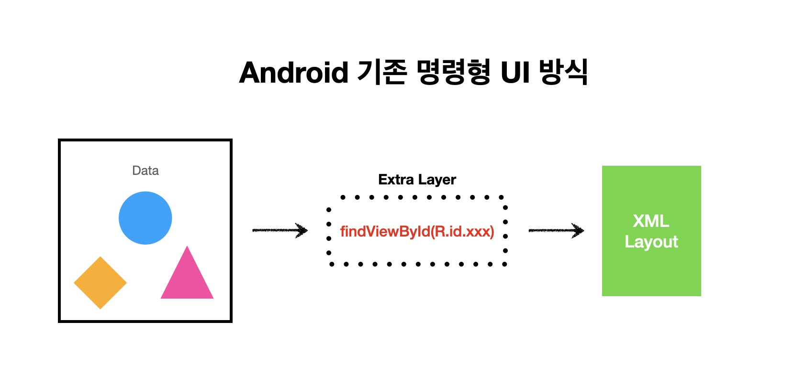
</div>

- 기존 ```.xml``` 방식
    - view 수정을 위해 xml 수정 -> kotlin 코드도 수정 
    - Kotlin code가 어떠한 안전장치도 없이 UI에 개념적으로 의존

<div align="center">
    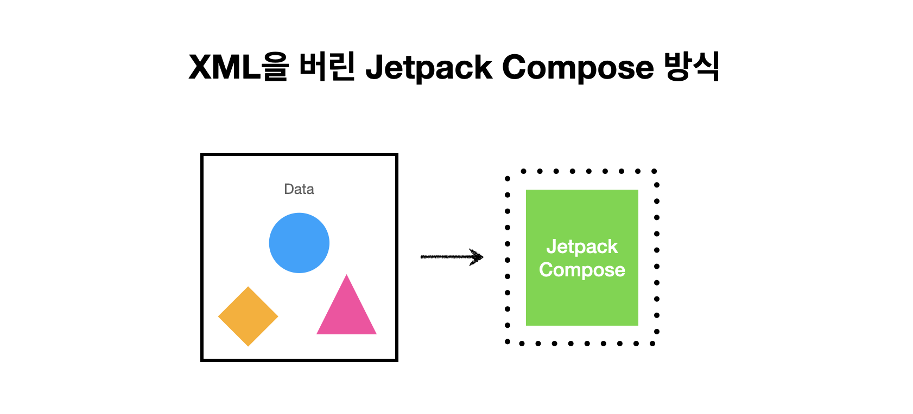
</div>

- ```Jetpack Compose```방식
    - 서로 다른 분야를 이어주며 강한 결합도를 가지는 Extra Layer가 사라짐
    - UI가 바뀌면, Composable 함수만 수정
